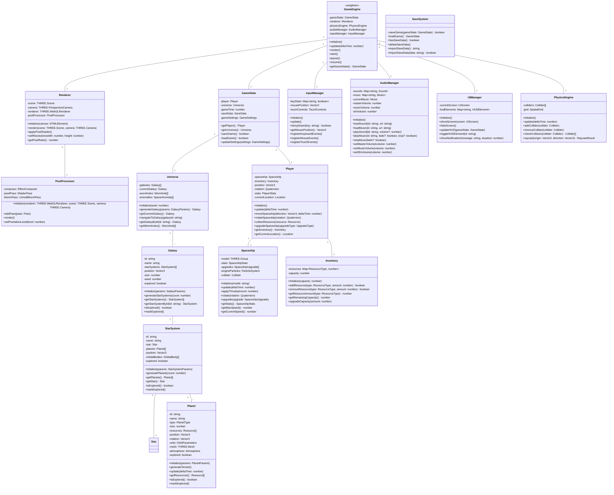
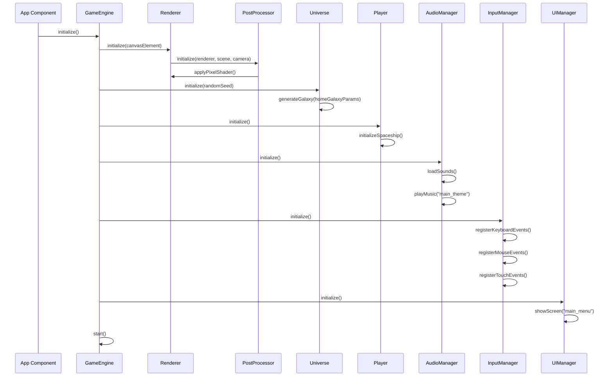
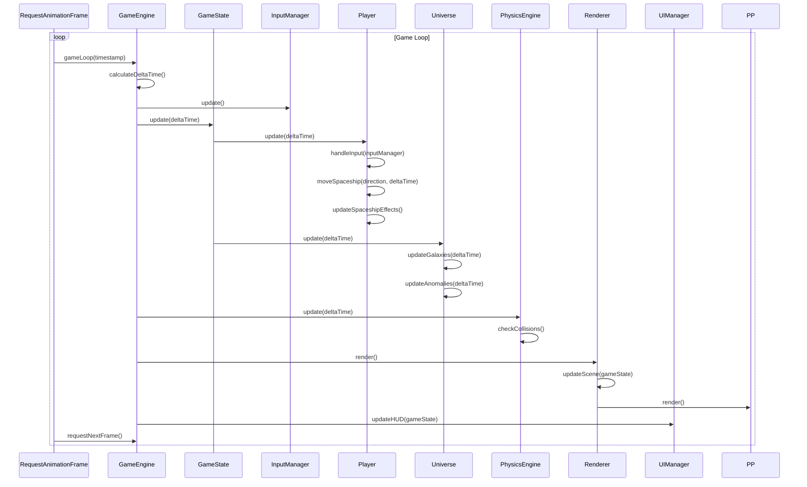
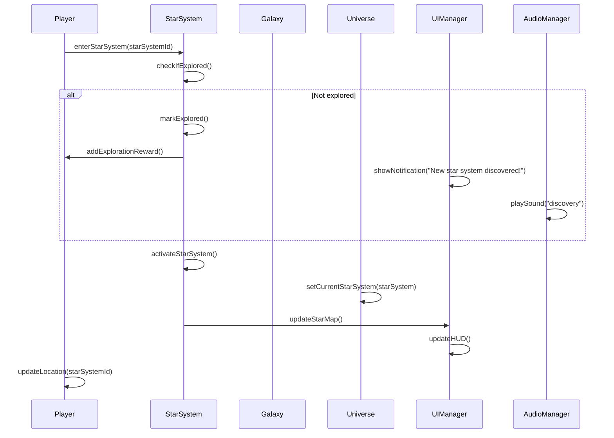
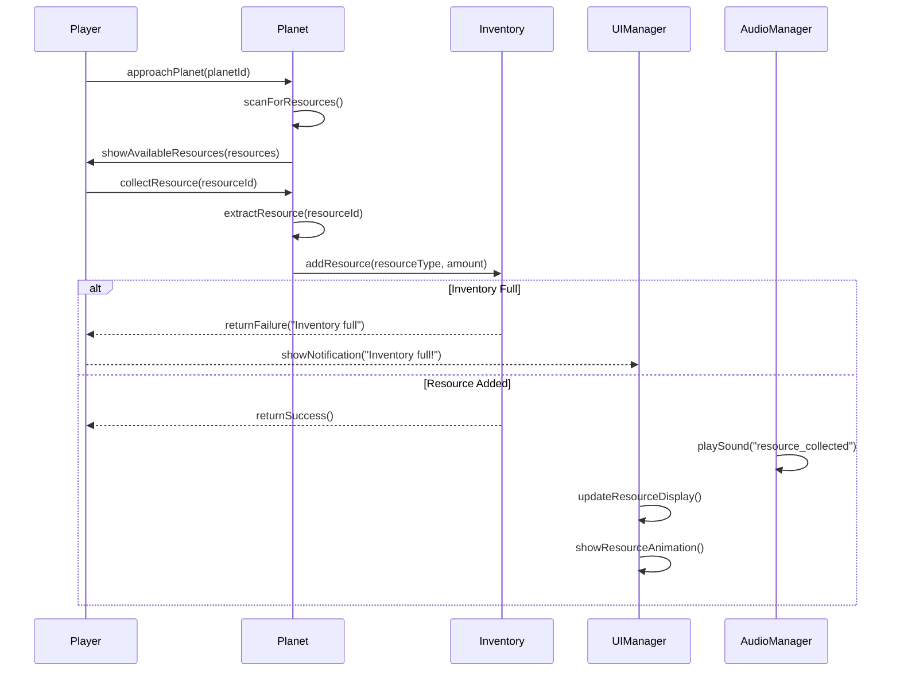
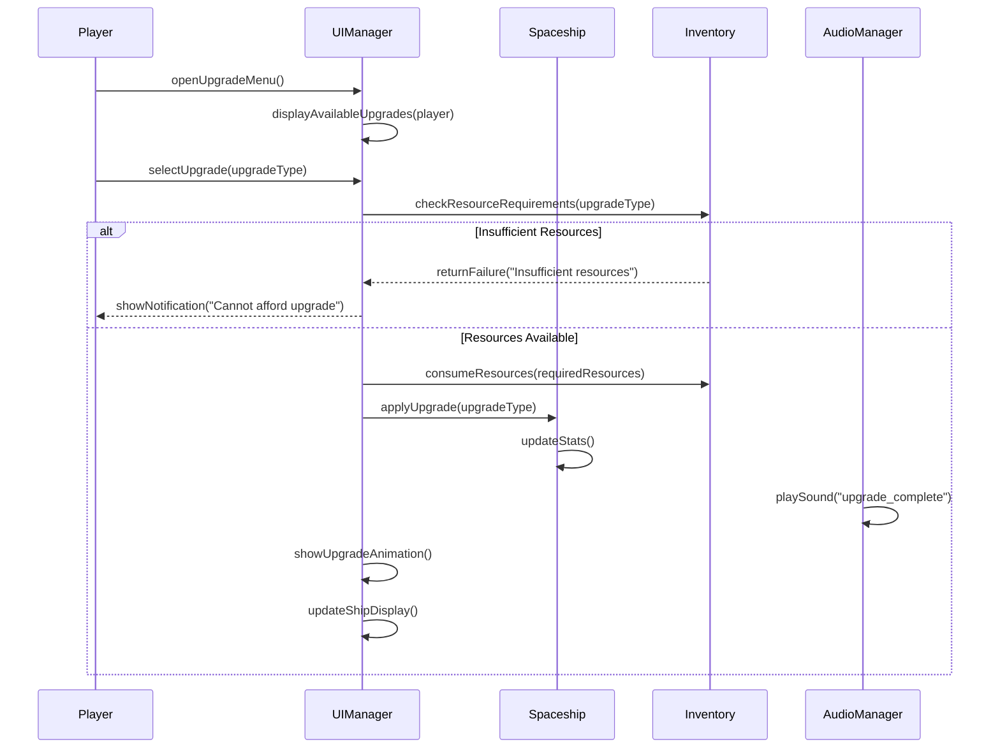

# 太空探索游戏系统架构设计

## Implementation approach

根据产品需求文档（PRD），我们设计一个基于Web的3D太空探索游戏，采用复古像素风格，让玩家能够在浩瀚宇宙中驾驶飞船探索不同星系。本项目的技术实现将面临以下难点：

1. **3D渲染与性能优化**：在Web环境下实现流畅的3D太空环境，同时保持复古像素风格
2. **大规模宇宙生成**：创建多样化且内容丰富的星系和行星
3. **直观的飞船控制系统**：设计符合Web交互习惯的飞船操控机制
4. **沉浸式音频体验**：实现动态音频系统，增强游戏氛围

为解决上述难点，我们选择以下技术栈和框架：

- **React**：构建UI组件和管理应用状态
- **Three.js**：3D渲染引擎，处理WebGL底层操作
- **React Three Fiber**：React的Three.js渲染器，简化3D与React集成
- **Zustand**：轻量级状态管理
- **Howler.js**：音频管理和播放
- **react-spring**：处理动画效果
- **simplex-noise**：生成程序化地形和星系
- **Tailwind CSS**：UI样式设计

## Data structures and interfaces

以下是系统的核心数据结构和接口设计：

## Program call flow

以下是系统主要功能的调用流程：

### 游戏初始化流程

### 游戏主循环流程

### 星系探索流程

### 行星资源收集流程

### 飞船升级流程

## Anything UNCLEAR

在项目实施过程中，需要特别注意以下几点，并在开发初期进行原型验证：

1. **复古像素风样式实现方式**：需要确定是通过着色器（shader）实现像素化效果，还是通过低分辨率贴图和模型？两种方案各有优缺点，需要进行原型测试以确定最佳平衡点。

2. **宇宙规模与性能平衡**：PRD中提到多个星系和行星，需要确定如何在保证性能的前提下实现大规模宇宙。可能需要采用层级细节（LOD）、惰性加载或程序化生成等技术。

3. **移动端支持策略**：PRD提到响应式设计和触屏控制，需要明确游戏在移动设备上的性能目标和优化策略，以及如何在触屏上提供良好的飞船控制体验。

4. **资源收集机制细节**：需要进一步明确资源收集的具体交互方式，是自动收集还是需要玩家主动操作，以及资源收集过程中是否有挑战性元素。

5. **游戏保存机制实现**：需要确定游戏存档的存储位置（localStorage、IndexedDB或云端），以及如何处理大型游戏状态的存储和恢复。