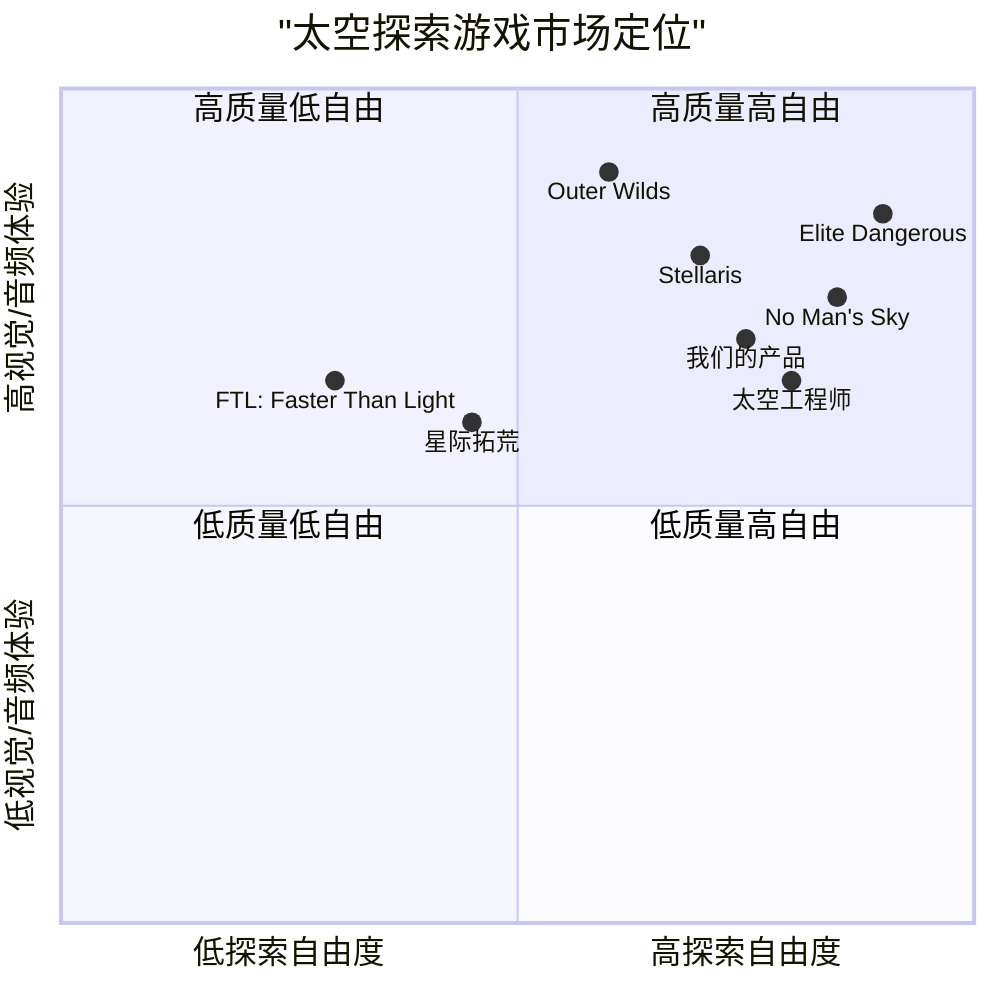

# 太空探索游戏产品需求文档(PRD)

## 1. 项目概述

### 1.1 项目背景

本项目旨在开发一款基于Web的3D太空探索游戏，让玩家能够在浩瀚的宇宙中驾驶飞船探索不同的星系。游戏采用复古像素风格的视觉设计，营造出神秘、壮观的太空探索体验，并通过精心选择的背景音乐和音效增强游戏的沉浸感。

### 1.2 项目名称

space_exploration_game

### 1.3 原始需求

- 创建一个3D太空探索题材的游戏
- 采用复古像素风格视觉设计
- 玩家可以驾驶飞船探索各个星系
- 营造神秘、浩瀚的感觉
- 选择合适的背景音乐和音效
- 基于Web技术实现（React、JavaScript和Three.js/WebGL）

## 2. 产品定义

### 2.1 产品目标

1. **创造沉浸式体验**：通过精美的3D太空环境和复古像素风格的视觉效果，为玩家提供身临其境的太空探索体验。

2. **提供探索自由度**：设计开放式宇宙环境，让玩家可以自由驾驶飞船探索不同的星系、行星和太空现象。

3. **平衡游戏性与可访问性**：确保游戏具有足够的深度和挑战性，同时保持对各类玩家的友好性和易于上手的特点。

### 2.2 用户故事

1. **作为一名太空探索爱好者**，我希望能在游戏中体验驾驶太空飞船的乐趣，以便满足我对太空探险的向往。

2. **作为一名休闲玩家**，我希望游戏有简单直观的操作方式，以便我能快速上手并享受游戏。

3. **作为一名探索者**，我希望游戏中有丰富多样的星系和行星可供探索，以便我能不断发现新奇的事物。

4. **作为一名收集爱好者**，我希望在探索过程中能够收集各种太空资源和物品，以便完成收藏并获得成就感。

5. **作为一名音乐爱好者**，我希望游戏有高质量的背景音乐和音效，以便增强我的游戏体验和沉浸感。

### 2.3 竞品分析

| 竞品 | 优势 | 劣势 |
|------|------|------|
| **No Man's Sky** | 庞大的程序生成宇宙；丰富的探索内容；多样化的星球生态系统 | 完整版本不基于Web；初期版本内容单调；学习曲线较陡 |
| **星际拓荒** | 复古风格的太空探索；简单但具有深度的资源管理；良好的叙事性 | 2D而非3D；规模较小；探索自由度有限 |
| **FTL: Faster Than Light** | 精良的太空飞船管理系统；高度策略性；独特的随机事件系统 | 缺乏开放探索；图形简单；重玩性依赖随机性 |
| **Stellaris** | 复杂的星际政治系统；深度文明建设；壮观的太空战斗 | 不适合休闲玩家；Web版本不存在；学习曲线陡峭 |
| **Elite Dangerous** | 真实感强的太空飞行体验；庞大的银河系模型；多种游戏风格 | 复杂的控制系统；内容获取需要大量时间投入；非Web平台 |
| **Outer Wilds** | 独特的时间循环机制；精心设计的太阳系；强调探索和发现 | 线性故事；规模有限；一次性体验 |
| **太空工程师(Space Engineers)** | 高度自由的建造系统；逼真的物理引擎；多人协作可能性 | 硬件要求高；学习曲线陡峭；缺乏明确目标 |

### 2.4 竞品象限图



## 3. 技术规格

### 3.1 需求分析

#### 3.1.1 前端技术栈

- **React**：用于构建用户界面和游戏UI组件
- **JavaScript**：核心编程语言
- **Three.js/WebGL**：用于3D渲染
- **Tailwind CSS**：用于UI样式设计
- **Howler.js**：用于音频处理

#### 3.1.2 核心功能需求

- 3D太空环境渲染
- 飞船控制系统
- 星系和行星生成
- 复古像素风格的视觉效果
- 资源收集和管理系统
- 宇宙导航和地图系统
- 音频系统（背景音乐和音效）
- 游戏进度保存和加载
- 响应式设计，支持不同设备

#### 3.1.3 性能需求

- 在中端配置设备上保持稳定的30+ FPS
- 页面加载时间控制在5秒以内
- 优化3D资源，确保流畅的Web体验
- 支持主流浏览器（Chrome、Firefox、Safari、Edge）

### 3.2 需求池

#### P0（必须实现）

1. **宇宙环境构建**：创建包含多个星系的3D太空环境，实现基本的星球、恒星和太空背景
2. **飞船操控系统**：实现直观的飞船控制机制，支持键盘和鼠标操作
3. **复古像素风视觉效果**：为3D模型应用像素风格的着色器和贴图
4. **基础音频系统**：实现主题背景音乐和基本飞行/交互音效
5. **星系探索机制**：允许玩家在不同星系间穿梭，并探索行星表面
6. **游戏保存功能**：允许玩家保存和加载游戏进度
7. **响应式UI**：适配不同屏幕尺寸的基本游戏界面
8. **性能优化**：确保在中端设备上流畅运行

#### P1（应该实现）

1. **资源收集系统**：允许玩家在探索过程中收集太空资源
2. **飞船升级系统**：使用收集的资源升级飞船性能和外观
3. **行星生态系统**：为不同行星创建独特的环境和生态特征
4. **高级音效系统**：为不同环境和事件添加动态音效
5. **星图和导航系统**：提供宇宙地图和导航辅助功能
6. **简单任务系统**：添加基础探索任务以引导玩家
7. **视觉特效优化**：添加粒子效果、光照和阴影等增强视觉体验
8. **触屏控制**：为移动设备优化的触屏控制方案

#### P2（可以实现）

1. **太空异常现象**：如黑洞、星云、陨石带等特殊探索区域
2. **宇宙生物**：可交互的外星生物或现象
3. **故事线索**：隐藏在宇宙各处的故事片段
4. **成就系统**：探索成就和收集里程碑
5. **飞船自定义**：更深入的飞船外观和功能自定义选项
6. **空间站和交易系统**：可访问的空间站和简单的资源交易
7. **多人游戏基础**：查看其他玩家探索记录的能力
8. **VR模式**：基础的WebVR支持

### 3.3 UI设计草图

#### 3.3.1 主界面

```
+-------------------------------------+
|                                     |
|         太空探索 (游戏标题)          |
|                                     |
|         [开始探索]  [加载游戏]       |
|                                     |
|         [设置]     [关于]           |
|                                     |
|         像素风格的太空背景          |
|         和飞船动态展示              |
|                                     |
+-------------------------------------+
```

#### 3.3.2 游戏主视图

```
+-------------------------------------+
| [资源: xxx] [能量: xxx] [导航按钮]  |
|                                     |
|                                     |
|                                     |
|         3D太空视图                  |
|         (飞船、行星、星系)          |
|                                     |
|                                     |
|                                     |
| [速度控制] [方向控制]  [菜单按钮]   |
+-------------------------------------+
```

#### 3.3.3 星图界面

```
+-------------------------------------+
| [返回] [当前位置: xxx星系]  [筛选]  |
|                                     |
|                                     |
|       可交互的星系地图              |
|       显示已探索和未探索区域        |
|       星球、空间站等标记            |
|                                     |
|                                     |
| [设置目标] [查看详情] [关闭地图]    |
+-------------------------------------+
```

#### 3.3.4 飞船升级界面

```
+-------------------------------------+
| [资源: xxx]           [返回]        |
|                                     |
| +-------+  +-------+  +-------+     |
| |引擎   |  |护盾   |  |武器   |     |
| |Lv.2   |  |Lv.1   |  |未解锁 |     |
| +-------+  +-------+  +-------+     |
|                                     |
| +-------+  +-------+  +-------+     |
| |导航   |  |货舱   |  |外观   |     |
| |Lv.1   |  |Lv.3   |  |       |     |
| +-------+  +-------+  +-------+     |
|                                     |
| [升级选定项] [价格: xxx资源]        |
+-------------------------------------+
```

### 3.4 开放性问题

1. **性能与复杂度平衡**：如何在保证Web应用流畅运行的前提下实现足够复杂的3D宇宙环境？

2. **程序生成与手工设计平衡**：使用多少程序生成内容vs手工设计内容来创建星系和行星？

3. **游戏进展机制**：是否需要明确的游戏进展路线或保持完全开放式探索？

4. **收益模式**：游戏应该采用什么样的收益模式？免费游玩还是付费下载？是否包含内购元素？

5. **多平台支持**：在确保Web版本质量的前提下，是否考虑后期开发移动应用或桌面应用版本？

6. **用户生成内容**：是否允许玩家创建和分享自定义内容，如自定义飞船或星球？

7. **学习曲线设计**：如何设计游戏教学系统，使新手能够轻松上手同时又不失游戏深度？

## 4. 游戏机制详细设计

### 4.1 飞船控制系统

#### 4.1.1 基本控制

- **键盘控制**：WASD或方向键控制飞船移动方向
- **鼠标控制**：控制视角和转向，点击互动
- **空格键**：加速/推进
- **Shift键**：减速/制动
- **Tab键**：打开/关闭星图

#### 4.1.2 飞行模式

- **巡航模式**：低速稳定飞行，适合近距离探索
- **加速模式**：高速飞行，适合星系间穿越
- **悬停模式**：停留在固定位置观察或与环境互动

### 4.2 星系探索系统

#### 4.2.1 星系结构

- 游戏宇宙包含**至少5个**独特星系
- 每个星系包含**3-8颗行星**和其他天体
- 星系间通过**虫洞或超空间跳跃**连接

#### 4.2.2 行星类型

1. **岩石行星**：矿产资源丰富
2. **气态巨行星**：能源资源丰富
3. **冰冻行星**：稀有资源和独特现象
4. **熔岩行星**：危险但资源丰富
5. **异常行星**：具有独特特性和珍稀资源

### 4.3 资源与升级系统

#### 4.3.1 可收集资源

- **常见矿物**：用于基础飞船维护和小型升级
- **稀有元素**：用于高级飞船升级
- **能源晶体**：为飞船提供动力和特殊能力
- **数据碎片**：解锁星图和发现信息
- **异常物质**：稀有发现，具有特殊用途

#### 4.3.2 飞船升级路径

- **引擎系统**：提升速度和机动性
- **导航系统**：增强星图功能和探测范围
- **护盾系统**：提高抵御太空危险的能力
- **货舱系统**：增加资源携带量
- **扫描系统**：提升资源探测和异常现象检测能力
- **外观定制**：解锁飞船视觉风格变化

### 4.4 音频系统设计

#### 4.4.1 背景音乐

- **主菜单音乐**：神秘而充满希望，设定游戏基调
- **探索音乐**：环境氛围为主，随星系不同而变化
- **发现音乐**：当发现新行星或特殊现象时触发
- **危险音乐**：遇到太空危险时的紧张节奏

#### 4.4.2 音效设计

- **飞船引擎音效**：复古风格的引擎声，随速度变化
- **UI交互音效**：像素风格的简洁界面音效
- **环境音效**：不同星系和行星的环境音
- **收集和发现音效**：资源收集和新发现的反馈音
- **警报音效**：能源不足或危险接近时

## 5. 开发路线图

### 5.1 第一阶段（核心功能）

- 基本3D太空环境构建
- 飞船控制系统实现
- 简单星系和行星生成
- 基础UI框架
- 基本音频系统

### 5.2 第二阶段（内容扩展）

- 完善星系结构和多样化行星
- 资源收集系统
- 飞船升级系统
- 高级音效和背景音乐
- 导航和星图系统

### 5.3 第三阶段（优化和额外功能）

- 游戏保存和加载系统
- 任务和发现系统
- 视觉特效优化
- 性能优化
- 响应式设计完善

## 6. 总结

本产品需求文档详细描述了一款基于Web的3D太空探索游戏的开发需求。游戏将采用复古像素风格的视觉设计，让玩家能够驾驶飞船在浩瀚的宇宙中探索不同星系，体验神秘而壮观的太空旅程。通过使用React、JavaScript和Three.js/WebGL技术，我们将创建一个既有深度又易于访问的Web游戏体验。

游戏的核心在于自由探索、发现和收集的乐趣，同时通过精心设计的音频系统和视觉效果增强沉浸感。市场分析表明，虽然太空探索游戏领域有多款成熟作品，但基于Web平台的高质量3D太空探索游戏仍有很大的市场潜力。

通过实施本文档中描述的需求和开发路线图，我们将创造一个独特的太空探索体验，满足用户对宇宙探索的向往，并在Web游戏领域树立新的标杆。